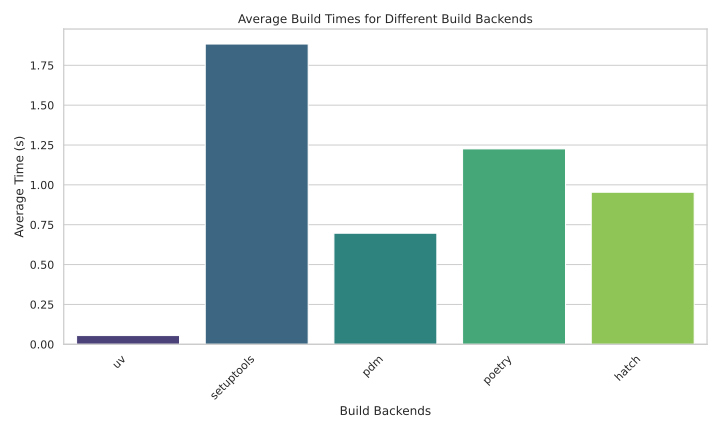

# Project introduction

Python packages can be built with different tools and backends, however each of
them comes with different performance and functionality differences. This
project aims to benchmark the most popular build backend tools, and summarize
the findings to allow users to carefully pick the build tool for their next
Python project.

This project aims to help engineers picking the build backend for their next
Python project. 

## Benchmark results

For this experiment, we considered five of the most popular python build
backends:
* uv
* setuptools
* poetry
* hatch
* pdm

The results shows some clear patterns, with UV consistenly outperforming all other
build backends. The ranking then continues with pdm, hatch, poetry showing
results close to each other. Finally, the most widely adopted build backend,
setuptools, is showing the slowest results out of all the build backends
analyzed.

We hope that this benchmark will give engineers some data on choosing the next
build backend for their projects, but we want to emphasize on other factors that
might be relevant for such decision. One such thing would be the extensibility
that the tooling provides. For example, the UV build backend is designed to work
closely with the UV toolkit, and it doesn't provide additional customizability
for things like dynamic versioning based on git tags. On the other hand, hatch
shows worse performance but it provides a full interface to extensibility with
the ability to develop custom plugins for all features.

It is also worth mentioning that there are additional build backends which we
didn't include in the analysis. The two worth mentioning are maturin, which
shows a significantly lower performance for building python projects because of
the fact that it builds a rust project that only exposes python bindings.
Maturin is extremly useful project, but it is not a great fit for this analysis.
Similarly, we also decided to exclude scikit-build which is designed for writing
CPython projects and compling them because it is not considering the workflow
that most engineers usually perform when developing Python libraries.

### Multi-core benchmark results

We repeated the same experiment while giving the docker container access to 4 
cores of the host machine. The results of this are available on the [second graph](../results/multi-core-benchmark.svg).
However, they show no difference at all with the main single core benchmark.

## Experiment description

To orchestrate the projects and compare each tool fairly we used UV as a project
manager. Each experiment was repeated 20 times to ensure fair consideration.

The UV tool for project management convinitely provides the initialization logic
for each of the backends, which we adopted to launch all python projects with
the same interface.

For each of the backends we initializated a new Python Projects and then
repeatedly build the same project for 20 times to fairly collect the build
speeds. To accommodate for warm-up times and caching, we didn't consider the
time of the first build command for any of the build backends.

To simulate single core and multi core environments, in the first experiment
we assigned only the core 0 to the docker container running the benchmarks. In
the second experiment we assigned cores 0 to 3 to the docker container.

All experiments were performed on an average Lenovo ThinkPad laptop which would
indicate an average engineer host machine.

> 📘
>
> This projects considers a limited set of build backends and benchmarks them
> on an empty python project with a limited source code. While it gives us
> good starting point for discussion and analysis, performance on real projects
> might be different. If you have any ideas how we can improve the benchmark
> and provide better analysis, please reach out by opening a new issue or 
> contribute a new change by opening a PR.