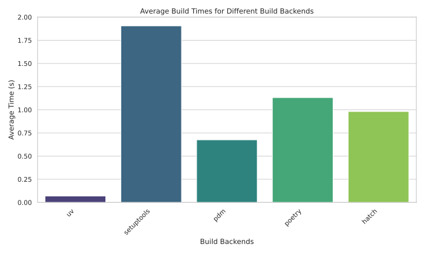

# Project Introduction

Python packages can be built with different tools and backends, however each of
them comes with different performance and functionality differences. This
project aims to benchmark the most popular build backend tools, and summarize
the findings to allow users to carefully pick the build tool for their next
Python project.

## Initial results

As an initial implementation, 7 build backends were benchmarked. The results
are not of a confirmed value yet, given that the environment was not properly
isolated and potentially has affected the results.

